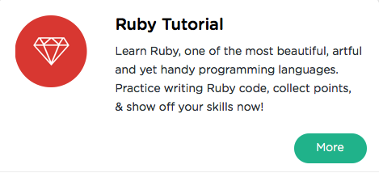

```
Roberto Nogueira  
BSd EE, MSd CE
Solution Integrator Experienced - Certified by Ericsson
```
# Sololearn Ruby



**About This Tutorial**

Learn all of the fundamentals of Ruby, and have fun while doing it – with SoloLearn!

[Sololearn Ruby](https://www.sololearn.com/Play/Ruby)

#### Topics
```
Ruby Tutorial
[x] Basic Concepts
[x] Control Structures
[x] Collections
[x] Methods
[x] Object Oriented Programming
[ ] Modules, Mixins, Standard Classe
[ ] Working with Files
[ ] Certificate
```
